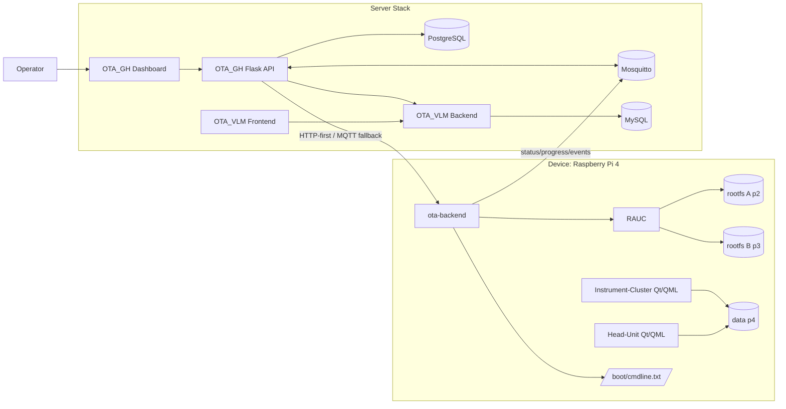

# OTA_HeadUnit_Itg Architecture

## 1. 시스템 개요

`OTA_HeadUnit_Itg`는 DES Head-Unit UI 스택과 yg OTA 스택을 통합한 구조다.
핵심 원칙은 다음과 같다.

1. 차량 UI/앱 체계(Head-Unit/Instrument-Cluster)는 DES 구현 유지
2. OTA는 RAUC 기반 A/B 업데이트로 통합
3. 서버는 OTA_GH(제어) + OTA_VLM(관제)로 분리
4. OTA 명령/번들 검증을 강화한 보안 경로 운영

## 2. 상위 구조

## 3. 디바이스 아키텍처

## 3.1 런타임 구성

- `ota-backend`:
  - OTA 트리거 수신(HTTP `/ota/start`, MQTT command)
  - 번들 다운로드
  - 명령 서명/무결성 검증
  - `rauc install` 수행
  - 이벤트/상태 리포팅

- `rauc`:
  - inactive 슬롯에 번들 적용
  - 설치/슬롯 상태 관리

- RAUC 커스텀 백엔드 스크립트:
  - `/boot/cmdline.txt`의 `root=/dev/mmcblk0p2|p3` 전환
  - mark-good / boot 상태 동기화

## 3.2 부팅 전략

- U-Boot 비활성화
- Raspberry Pi firmware direct boot 사용
- 부팅 슬롯 source-of-truth는 `/boot/cmdline.txt`

이 전략은 RAUC 커스텀 스크립트와 충돌이 적고,
디바이스에서 슬롯 전환을 단일 경로로 유지할 수 있다.

## 3.3 파티션 모델

- `p1`: boot (FAT)
- `p2`: rootfs A
- `p3`: rootfs B
- `p4`: data

`WKS_FILE = des-ab-sdimage.wks` 기반으로 A/B 구조를 생성한다.

## 4. 서버 아키텍처

## 4.1 OTA_GH (제어 plane)

역할:
- 펌웨어 업로드/메타데이터 저장
- 디바이스 목록/상태 관리
- 업데이트 트리거 API 제공
- HTTP-first, MQTT-fallback 전송 정책

주요 엔드포인트:
- `POST /api/v1/admin/firmware`
- `POST /api/v1/admin/trigger-update`
- `GET /api/v1/vehicles`
- `GET /health`

## 4.2 OTA_VLM (관제 plane)

역할:
- 이벤트 수집 및 관제 대시보드 제공
- 실패 케이스, 통계, 가시성 제공

## 4.3 메시징

- 브로커: Mosquitto
- 토픽 패턴:
  - command: `ota/{vehicle_id}/cmd`
  - status: `ota/{vehicle_id}/status`
  - progress: `ota/{vehicle_id}/progress`

## 5. OTA 데이터/제어 흐름

## 5.1 정상 시나리오

1. 운영자가 `.raucb` 업로드
2. OTA_GH가 target firmware 결정
3. OTA_GH가 OTA 명령 payload 생성
4. OTA_GH가 payload 서명(ed25519)
5. OTA_GH -> 디바이스 HTTP `/ota/start` 시도
6. HTTP 실패 시 MQTT command 발행
7. ota-backend가 번들 다운로드
8. ota-backend가 signature + SHA256/size 검증
9. RAUC가 inactive 슬롯에 설치
10. ota-backend post-write 검증 수행
11. 재부팅/commit 처리
12. 상태/결과가 `ota/server`/`ota/OTA_VLM`로 수집

## 5.2 실패 및 보호 경로

- 서명 실패: 설치 중단
- SHA256/size mismatch: 설치 중단
- RAUC install 실패: 상태 `failed`
- post-write 실패: 상태 `failed`
- 트리거 전송 실패: HTTP/MQTT 교차 fallback

## 6. 보안 설계

## 6.1 이중 검증 구조

1. OTA 명령 검증
- 서버가 ed25519 개인키로 명령 서명
- 디바이스가 공개키로 검증

2. 번들 무결성 검증
- expected `sha256` / `size` 검증

3. 설치 후 검증
- `e2fsck` 기반 post-write verify

## 6.2 키 관리 표준 경로

- `ota/keys/rauc/`
- `ota/keys/ed25519/`

Yocto 레시피를 통해 공개키/인증서가 런타임에 반영된다.

## 7. 빌드/배포 아키텍처

## 7.1 이미지 빌드

- 스크립트: `ota/tools/build-image.sh`
- 산출물:
  - `.wic.bz2` + `.wic.bmap` (초기 플래싱용)
  - `.ext4.bz2` (rootfs 산출물)

## 7.2 OTA 번들 빌드

- 스크립트: `ota/tools/build-rauc-bundle.sh`
- 산출물: `.raucb`

## 7.3 초기 배포 vs OTA 배포

- 초기 배포: `bmaptool`로 `.wic.bz2`를 디스크에 직접 기록
- OTA 배포: OTA_GH 업로드 + trigger -> 디바이스 RAUC 설치

## 8. 설정 책임 분리

## 8.1 Yocto(빌드타임)

- 이미지 구성/패키지/파티션 레이아웃
- 부트 정책(`RPI_USE_U_BOOT=0`)
- 키/스크립트 배치

## 8.2 런타임(디바이스)

- `/etc/ota-backend/config.json` 정책
- OTA 수신/검증/설치 동작

## 8.3 런타임(서버)

- `.env` 기반 API/브로커/키 경로
- firmware base URL
- local device mapping

## 9. 운영상 중요 포인트

1. 부팅 슬롯 판단은 반드시 `cmdline.txt` 기준으로 통일
2. 키 재생성 시 서버/디바이스 키 동기화 필수
3. 빌드 디스크 여유는 40~50GB 이상 확보 권장
4. 포트 충돌 시 기존 compose 스택 정리 후 기동
5. E2E 결과는 디바이스 로그 + 서버 이력 모두로 판정

## 10. 추후 개선 후보

1. OTA 실패 시 자동 진단 리포트 표준화
2. CI에서 OTA_GH + ota-backend contract test 자동화
3. OTA 정책(강제/유예/배터리/주행상태) 룰 엔진화
4. 관제 대시보드의 실패 원인 분류 정밀도 개선

---

관련 문서:
- `README.md`
- `OTA_Project_Detailed_Guide.md`
- `OTA_E2E_TEST_GUIDE.md`
